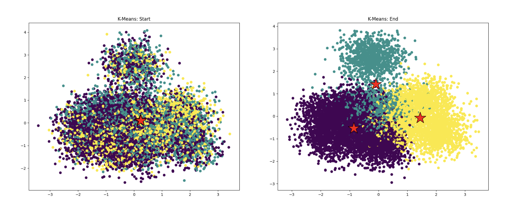

# Assignment 1: Performance Analysis on a Quad-Core CPU #

**Due Mon Oct 7, 11:59pm**

**100 points total + 6 points extra credit**

## Overview ##

This assignment is intended to help you develop an understanding of the two primary forms of parallel execution present in a modern multi-core CPU:

1. SIMD execution within a single processing core
2. Parallel execution using multiple cores (You'll see effects of Intel Hyper-threading as well.)

You will also gain experience measuring and reasoning about the
performance of parallel programs (a challenging, but important, skill you will
use throughout this class). This assignment involves only a small amount of
programming, but a lot of analysis!

## 概述 ##

本作业旨在帮助您理解现代多核CPU中存在的两种主要并行执行形式：

1. 单个处理核心内的SIMD（单指令多数据）执行
2. 使用多个核心的并行执行（您还将看到Intel超线程技术的影响。）

您还将获得衡量和分析并行程序性能的经验（这是一种具有挑战性但重要的技能，您将在整个课程中使用）。本次作业涉及的编程量不大，但需要大量的分析！

## Environment Setup ##

__You will need to run code on the new myth machines for this assignment__
(Hostnames for these machines are `myth[51-66].stanford.edu`). If for some reason you do not have a home directory on the myth machines, submit a HelpSU ticket [here](https://stanford.service-now.com/it_services?id=sc_cat_item&sys_id=cab169801bd918d0685d4377cc4bcbe0).

These machines contain four-core 4.2 GHz Intel Core i7 processors (although dynamic frequency scaling can take them to 4.5 GHz when the chip decides it is useful and possible to do so). Each core in the processor supports two hardware threads (Intel calls this "Hyper-Threading") and the cores can execute AVX2 vector instructions which describe
simultaneous execution of the same eight-wide operation on multiple single-precision data
values. For the curious, a complete specification for this CPU can be found at 
<https://ark.intel.com/products/97129/Intel-Core-i7-7700K-Processor-8M-Cache-up-to-4-50-GHz->. Students that want to dig deeper might enjoy [this writeup](https://en.wikichip.org/wiki/intel/microarchitectures/kaby_lake).

Note: For grading purposes, we expect you to report on the performance of code run on the Stanford myth machines, however
for kicks, you may also want to run the programs in this assignment on your own machine. (You will first need to install the Intel SPMD Program Compiler (ISPC) available here: <http://ispc.github.io/>). Feel free to include your findings from running code on other machines in your report as well, just be very clear what machine you were running on. 

To get started:

1. ISPC is needed to compile many of the programs used in this assignment. ISPC can be easily installed on the myth machines through the following steps:  

From a myth machine, download the linux binary into a local directory of your choice.  You can get ISPC compiler binaries for Linux from the ISPC [downloads page](https://ispc.github.io/downloads.html).  From `myth`, we recommend you use `wget` to directly download the binary from the downloads page. As of Fall 2024 Week 1, the `wget` line below works:

    wget https://github.com/ispc/ispc/releases/download/v1.24.0/ispc-v1.24.0-linux.tar.gz

Untar the downloaded file: `tar -xvf ispc-v1.24.0-linux.tar.gz`

Add the ISPC `bin` directory to your system path.  For example, if untarring the downloaded file produces the directory `~/Downloads/ispc-v1.24.0-linux`, in bash you'd update your path variable with:

    export PATH=$PATH:${HOME}/Downloads/ispc-v1.24.0-linux/bin

The above line can be added to your `.bashrc` file for permanence.

If you are using csh, you'll update your `PATH` using `setenv`.  A quick Google search will teach you how. 

2. The assignment starter code is available on <https://github.com/stanford-cs149/asst1>. Please clone the Assignment 1 starter code using:

    `git clone https://github.com/stanford-cs149/asst1.git`

## 环境搭建 ##

__您需要在新的myth机器上运行此作业的代码__（这些机器的主机名是 `myth[51-66].stanford.edu`）。如果由于某种原因您在myth机器上没有主目录，请提交一个HelpSU工单 [这里](https://stanford.service-now.com/it_services?id=sc_cat_item&sys_id=cab169801bd918d0685d4377cc4bcbe0)。

这些机器配备了四核4.2 GHz的Intel Core i7处理器（尽管动态频率缩放可以使它们在芯片认为有用且可行时达到4.5 GHz）。处理器中的每个核心支持两个硬件线程（Intel称之为“超线程”），并且核心可以执行AVX2向量指令，这些指令描述了对多个单精度数据值同时执行相同的操作。对于好奇的读者，可以在以下网址找到该CPU的完整规格：
<https://ark.intel.com/products/97129/Intel-Core-i7-7700K-Processor-8M-Cache-up-to-4-50-GHz->。想要深入了解的学生可能会喜欢[这篇介绍](https://en.wikichip.org/wiki/intel/microarchitectures/kaby_lake)。

注意：出于评分目的，我们期望您报告在斯坦福大学myth机器上运行代码的性能，但是
为了娱乐，您也可以在自己的机器上运行此作业中的程序。（首先，您需要安装Intel SPMD程序编译器（ISPC），可从这里下载：<http://ispc.github.io/>）。您也可以在报告中包括在其他机器上运行代码的发现，只需非常清楚地说明您是在哪台机器上运行的即可。

开始步骤如下：

1. ISPC用于编译此作业中使用的许多程序。在myth机器上可以通过以下步骤轻松安装ISPC：

从myth机器上，下载Linux二进制文件到您选择的本地目录。您可以从ISPC的[下载页面](https://ispc.github.io/downloads.html)获取Linux的ISPC编译器二进制文件。从`myth`，我们建议您使用`wget`直接从下载页面下载二进制文件。截至2024年秋季第1周，下面的`wget`行有效：

    wget https://github.com/ispc/ispc/releases/download/v1.24.0/ispc-v1.24.0-linux.tar.gz

解压下载的文件：`tar -xvf ispc-v1.24.0-linux.tar.gz`

将ISPC的`bin`目录添加到您的系统路径中。例如，如果解压下载的文件产生了`~/Downloads/ispc-v1.24.0-linux`目录，在bash中您可以通过以下命令更新路径变量：

    export PATH=$PATH:${HOME}/Downloads/ispc-v1.24.0-linux/bin

上述行可以添加到您的`.bashrc`文件中以便永久生效。

如果您使用的是csh，您将使用`setenv`来更新`PATH`。快速Google搜索可以教您如何操作。

2. 作业的启动代码可在 <https://github.com/stanford-cs149/asst1> 获取。请克隆Assignment 1的启动代码，使用以下命令：

    `git clone https://github.com/stanford-cs149/asst1.git`

## Program 1: Parallel Fractal Generation Using Threads (20 points) ##

Build and run the code in the `prog1_mandelbrot_threads/` directory of
the code base. (Type `make` to build, and `./mandelbrot` to run it.)
This program produces the image file `mandelbrot-serial.ppm`, which is a visualization of a famous set of
complex numbers called the Mandelbrot set. Most platforms have a .ppm
view. To view the resulting images remotely, first make sure that you have _X server_. No downloads are needed
for Linux systems. However, for Mac you can use [Xquartz](https://www.xquartz.org/) and 
for Windows you can use [VcXsrv](https://sourceforge.net/projects/vcxsrv/).
After you have SSH X-Forwarding support, make sure you `ssh -Y` onto a myth machine and
you can then view the images using the `display` command. As you can see in the images below, the
result is a familiar and beautiful fractal.  Each pixel in the image
corresponds to a value in the complex plane, and the brightness of
each pixel is proportional to the computational cost of determining
whether the value is contained in the Mandelbrot set. To get image 2,
use the command option `--view 2`.  (See function `mandelbrotSerial()`
defined in `mandelbrotSerial.cpp`). You can learn more about the
definition of the Mandelbrot set at
<http://en.wikipedia.org/wiki/Mandelbrot_set>.

Your job is to parallelize the computation of the images using 
[std::thread](https://en.cppreference.com/w/cpp/thread/thread). Starter
code that spawns one additional thread is provided in the function
`mandelbrotThread()` located in `mandelbrotThread.cpp`. In this function, the
main application thread creates another additional thread using the constructor
`std::thread(function, args...)` It waits for this thread to complete by calling
`join` on the thread object.
Currently the launched thread does not do any computation and returns immediately.
You should add code to `workerThreadStart` function to accomplish this task.
You will not need to make use of any other std::thread API calls in this assignment.

**What you need to do:**

1.  Modify the starter code to parallelize the Mandelbrot generation using 
 two processors. Specifically, compute the top half of the image in
  thread 0, and the bottom half of the image in thread 1. This type
    of problem decomposition is referred to as _spatial decomposition_ since
  different spatial regions of the image are computed by different processors.
2.  Extend your code to use 2, 3, 4, 5, 6, 7, and 8 threads, partitioning the image
  generation work accordingly (threads should get blocks of the image). Note that the processor only has four cores but each
  core supports two hyper-threads, so it can execute a total of eight threads interleaved on its execution contents.
  In your write-up, produce a graph of __speedup compared to the reference sequential implementation__ as a function of the number of threads used __FOR VIEW 1__. Is speedup linear in the number of threads used? In your writeup hypothesize why this is (or is not) the case? (you may also wish to produce a graph for VIEW 2 to help you come up with a good answer. Hint: take a careful look at the three-thread datapoint.)
3.  To confirm (or disprove) your hypothesis, measure the amount of time
  each thread requires to complete its work by inserting timing code at
  the beginning and end of `workerThreadStart()`. How do your measurements
  explain the speedup graph you previously created?
4.  Modify the mapping of work to threads to achieve to improve speedup to
  at __about 7-8x on both views__ of the Mandelbrot set (if you're above 7x that's fine, don't sweat it). You may not use any
  synchronization between threads in your solution. We are expecting you to come up with a single work decomposition policy that will work well for all thread counts---hard coding a solution specific to each configuration is not allowed! (Hint: There is a very simple static
  assignment that will achieve this goal, and no communication/synchronization
  among threads is necessary.). In your writeup, describe your approach to parallelization
  and report the final 8-thread speedup obtained. 
5. Now run your improved code with 16 threads. Is performance noticably greater than when running with eight threads? Why or why not? 

## 程序1：使用线程并行生成分形图像 (20分) ##

在代码库的 `prog1_mandelbrot_threads/` 目录中构建和运行代码。（输入 `make` 构建，输入 `./mandelbrot` 运行。）此程序生成一个名为 `mandelbrot-serial.ppm` 的图像文件，这是对复数集合中的著名成员——曼德布罗特集（Mandelbrot set）的一种可视化。大多数平台都有 .ppm 查看器。要远程查看生成的图像，请确保您有_X服务器_。Linux系统不需要下载任何东西。然而，对于Mac，您可以使用[Xquartz](https://www.xquartz.org/)，而对于Windows，您可以使用[VcXsrv](https://sourceforge.net/projects/vcxsrv/)。
在设置好SSH X-转发支持后，确保您通过 `ssh -Y` 登录到myth机器上，
然后可以使用 `display` 命令来查看图像。如下面的图像所示，结果是一个熟悉且美丽的分形。图像中的每个像素对应于复平面上的一个值，每个像素的亮度与确定该值是否包含在曼德布罗特集合中的计算成本成正比。要获取图像2，使用命令选项 `--view 2`。（参见定义在 `mandelbrotSerial.cpp` 中的 `mandelbrotSerial()` 函数）。您可以在 <http://en.wikipedia.org/wiki/Mandelbrot_set> 上了解更多关于曼德布罗特集合的定义。

您的任务是使用 [std::thread](https://en.cppreference.com/w/cpp/thread/thread) 并行化图像的计算。在 `mandelbrotThread.cpp` 文件中提供了启动代码，它创建了一个额外的线程。在这个函数中，主应用程序线程使用构造函数 `std::thread(function, args...)` 创建另一个额外的线程，并通过调用线程对象上的 `join` 方法等待这个线程完成。
目前，启动的线程没有执行任何计算，而是立即返回。您应该向 `workerThreadStart` 函数添加代码以完成此任务。
在这个任务中，您不需要使用其他任何 std::thread API 调用。

**您需要做的：**

1. 修改启动代码，使用两个处理器并行化曼德布罗特图像的生成。具体来说，在线程0中计算图像的上半部分，在线程1中计算下半部分。这种问题分解方式被称为_空间分解_，因为不同的处理器计算图像的不同空间区域。
2. 扩展您的代码以使用2、3、4、5、6、7和8个线程，相应地分配图像生成工作（线程应获得图像块）。请注意，处理器只有四个核心，但每个核心支持两个超线程，因此它可以交错执行总共八个线程在其执行内容上。在您的报告中，绘制一张图表显示与参考顺序实现相比的加速比作为所使用线程数量的函数 __针对视图1__。加速比是否随使用的线程数量线性增加？在您的报告中推测为什么会出现这种情况（或不是这种情况）。您可能还希望为视图2生成一张图表以帮助您得出一个好的答案。（提示：仔细观察三个线程的数据点。）
3. 为了确认（或反驳）您的假设，测量每个线程完成其工作所需的时间，方法是在 `workerThreadStart()` 的开始和结束处插入计时代码。您的测量如何解释之前创建的加速比图表？
4. 修改工作映射到线程的方法，使速度提升达到 __大约7-8倍于两种视图__ 的曼德布罗特集合（如果您超过7倍那是好的，不必过分担心）。您不允许在线程之间使用任何同步。我们期望您能够提出一种适用于所有线程配置的工作分解策略——不允许为每个配置硬编码解决方案！（提示：有一个非常简单的静态分配可以实现这一目标，而且线程间不需要任何通信/同步。）在您的报告中，描述您的并行化方法，并报告最终的8线程加速比。
5. 现在用16个线程运行您的改进代码。性能是否有明显提高？为什么或为什么不呢？
  
## Program 2: Vectorizing Code Using SIMD Intrinsics (20 points) ##

Take a look at the function `clampedExpSerial` in `prog2_vecintrin/main.cpp` of the
Assignment 1 code base.  The `clampedExp()` function raises `values[i]` to the power given by `exponents[i]` for all elements of the input array and clamps the resulting values at 9.999999.  In program 2, your job is to vectorize this piece of code so it can be run on a machine with SIMD vector instructions.

However, rather than craft an implementation using SSE or AVX2 vector intrinsics that map to real SIMD vector instructions on modern CPUs, to make things a little easier, we're asking you to implement your version using CS149's "fake vector intrinsics" defined in `CS149intrin.h`.   The `CS149intrin.h` library provides you with a set of vector instructions that operate
on vector values and/or vector masks. (These functions don't translate to real CPU vector instructions, instead we simulate these operations for you in our library, and provide feedback that makes for easier debugging.)  As an example of using the CS149 intrinsics, a vectorized version of the `abs()` function is given in `main.cpp`. This example contains some basic vector loads and stores and manipulates mask registers.  Note that the `abs()` example is only a simple example, and in fact the code does not correctly handle all inputs! (We will let you figure out why!) You may wish to read through all the comments and function definitions in `CS149intrin.h` to know what operations are available to you. 

Here are few hints to help you in your implementation:

-  Every vector instruction is subject to an optional mask parameter.  The mask parameter defines which lanes whose output is "masked" for this operation. A 0 in the mask indicates a lane is masked, and so its value will not be overwritten by the results of the vector operation. If no mask is specified in the operation, no lanes are masked. (Note this equivalent to providing a mask of all ones.) 
   *Hint:* Your solution will need to use multiple mask registers and various mask operations provided in the library.
-  *Hint:* Use `_cs149_cntbits` function helpful in this problem.
-  Consider what might happen if the total number of loop iterations is not a multiple of SIMD vector width. We suggest you test 
your code with `./myexp -s 3`. *Hint:* You might find `_cs149_init_ones` helpful.
-  *Hint:* Use `./myexp -l` to print a log of executed vector instruction at the end. 
Use function `addUserLog()` to add customized debug information in log. Feel free to add additional 
`CS149Logger.printLog()` to help you debug.

The output of the program will tell you if your implementation generates correct output. If there
are incorrect results, the program will print the first one it finds and print out a table of
function inputs and outputs. Your function's output is after "output = ", which should match with 
the results after "gold = ". The program also prints out a list of statistics describing utilization of the CS149 fake vector
units. You should consider the performance of your implementation to be the value "Total Vector 
Instructions". (You can assume every CS149 fake vector instruction takes one cycle on the CS149 fake SIMD CPU.) "Vector Utilization" 
shows the percentage of vector lanes that are enabled. 

**What you need to do:**

1.  Implement a vectorized version of `clampedExpSerial` in `clampedExpVector` . Your implementation 
should work with any combination of input array size (`N`) and vector width (`VECTOR_WIDTH`). 
2.  Run `./myexp -s 10000` and sweep the vector width from 2, 4, 8, to 16. Record the resulting vector 
utilization. You can do this by changing the `#define VECTOR_WIDTH` value in `CS149intrin.h`. 
Does the vector utilization increase, decrease or stay the same as `VECTOR_WIDTH` changes? Why?
3.  _Extra credit: (1 point)_ Implement a vectorized version of `arraySumSerial` in `arraySumVector`. Your implementation may assume that `VECTOR_WIDTH` is a factor of the input array size `N`. Whereas the serial implementation runs in `O(N)` time, your implementation should aim for runtime of `(N / VECTOR_WIDTH + VECTOR_WIDTH)` or even `(N / VECTOR_WIDTH + log2(VECTOR_WIDTH))`  You may find the `hadd` and `interleave` operations useful.

## 程序 2：使用 SIMD 内在函数向量化代码（20 分）

请查看 `prog2_vecintrin/main.cpp` 中的 `clampedExpSerial` 函数。`clampedExp()` 函数将输入数组中的每个 `values[i]` 提升到 `exponents[i]` 指定的幂次方，并将结果值限制在 9.999999。在程序 2 中，您的任务是向量化这段代码，使其能够在支持 SIMD 向量指令的机器上运行。

然而，为了简化任务，我们要求您使用 `CS149intrin.h` 中定义的 CS149 “假向量内在函数”来实现您的版本。`CS149intrin.h` 库为您提供了一组操作向量值和/或向量掩码的向量指令。（这些函数不会转换为实际的 CPU 向量指令，而是我们在库中模拟这些操作，并提供便于调试的反馈。）作为使用 CS149 内在函数的一个例子，在 `main.cpp` 中给出了一个向量化的 `abs()` 函数。这个例子包含了一些基本的向量加载和存储操作，并且操作了掩码寄存器。请注意，`abs()` 示例并不正确处理所有输入！（我们会让您自己找出原因！）您可以阅读 `CS149intrin.h` 中的所有注释和函数定义，了解可用的操作。

以下是一些帮助您实现的提示：

- 每个向量指令都有一个可选的掩码参数。掩码参数定义了哪些通道的输出被“屏蔽”了。掩码中的 0 表示该通道被屏蔽，其值不会被向量操作的结果覆盖。如果没有指定掩码，则没有通道被屏蔽。（这相当于提供了一个全为 1 的掩码。）
  *提示：* 您的解决方案需要使用多个掩码寄存器和库中提供的各种掩码操作。
- *提示：* `_cs149_cntbits` 函数在这道题中非常有用。
- 考虑如果总循环次数不是 SIMD 向量宽度的倍数会发生什么。建议您使用 `./myexp -s 3` 测试您的代码。*提示：* 您可能发现 `_cs149_init_ones` 很有帮助。
- *提示：* 使用 `./myexp -l` 打印执行的向量指令日志。使用 `addUserLog()` 添加自定义的调试信息到日志中。您可以自由添加 `CS149Logger.printLog()` 来帮助您调试。

程序的输出会告诉您实现是否生成了正确的输出。如果有错误结果，程序会打印出第一个错误结果，并打印出一个包含函数输入和输出的表格。您的函数输出在 "output = " 之后，应该与 "gold = " 之后的结果匹配。程序还会打印出描述 CS149 假向量单元使用情况的一系列统计数据。您可以将实现的性能视为“Total Vector Instructions”（总向量指令数）。（您可以假设每个 CS149 假向量指令在 CS149 假 SIMD CPU 上执行一个周期。）“Vector Utilization”（向量利用率）显示了启用的向量通道百分比。

**您需要做的：**

1. 实现在 `clampedExpVector` 中的 `clampedExpSerial` 的向量化版本。您的实现应适用于任何输入数组大小（`N`）和向量宽度（`VECTOR_WIDTH`）的组合。
2. 运行 `./myexp -s 10000` 并将向量宽度从 2、4、8 到 16 逐步调整。记录每次测试的向量利用率。您可以通过更改 `CS149intrin.h` 中的 `#define VECTOR_WIDTH` 值来实现这一点。随着 `VECTOR_WIDTH` 的变化，向量利用率是增加、减少还是保持不变？为什么？
3. *额外学分：（1 分）* 实现在 `arraySumVector` 中的 `arraySumSerial` 的向量化版本。您的实现可以假设 `VECTOR_WIDTH` 是输入数组大小 `N` 的因数。虽然串行实现的运行时间为 `O(N)`，但您的实现应力求达到 `(N / VECTOR_WIDTH + VECTOR_WIDTH)` 甚至 `(N / VECTOR_WIDTH + log2(VECTOR_WIDTH))` 的运行时间。您可能会发现 `hadd` 和 `interleave` 操作很有用。

## Program 3: Parallel Fractal Generation Using ISPC (20 points) ##

Now that you're comfortable with SIMD execution, we'll return to parallel Mandelbrot fractal generation (like in program 1). Like Program 1, Program 3 computes a mandelbrot fractal image, but it achieves even greater speedups by utilizing both the CPU's four cores and the SIMD execution units within each core.

In Program 1, you parallelized image generation by creating one thread
for each processing core in the system. Then, you assigned parts of
the computation to each of these concurrently executing
threads. (Since threads were one-to-one with processing cores in
Program 1, you effectively assigned work explicitly to cores.) Instead
of specifying a specific mapping of computations to concurrently
executing threads, Program 3 uses ISPC language constructs to describe
*independent computations*. These computations may be executed in
parallel without violating program correctness (and indeed they
will!). In the case of the Mandelbrot image, computing the value of
each pixel is an independent computation. With this information, the
ISPC compiler and runtime system take on the responsibility of
generating a program that utilizes the CPU's collection of parallel
execution resources as efficiently as possible.

You will make a simple fix to Program 3 which is written in a combination of
C++ and ISPC (the error causes a performance problem, not a correctness one).
With the correct fix, you should observe performance that is over 32 times
greater than that of the original sequential Mandelbrot implementation from
`mandelbrotSerial()`.

### Program 3, Part 1. A Few ISPC Basics (10 of 20 points) ###

When reading ISPC code, you must keep in mind that although the code appears
much like C/C++ code, the ISPC execution model differs from that of standard
C/C++. In contrast to C, multiple program instances of an ISPC program are
always executed in parallel on the CPU's SIMD execution units. The number of
program instances executed simultaneously is determined by the compiler (and
chosen specifically for the underlying machine). This number of concurrent
instances is available to the ISPC programmer via the built-in variable
`programCount`. ISPC code can reference its own program instance identifier via
the built-in `programIndex`. Thus, a call from C code to an ISPC function can
be thought of as spawning a group of concurrent ISPC program instances
(referred to in the ISPC documentation as a gang). The gang of instances
runs to completion, then control returns back to the calling C code.

__Stop. This is your friendly instructor. Please read the preceding paragraph again. Trust me.__

As an example, the following program uses a combination of regular C code and ISPC
code to add two 1024-element vectors. As we discussed in class, since each
instance in a gang is independent and performing the exact
same program logic, execution can be accelerated via
implementation using SIMD instructions.

A simple ISPC program is given below. The following C code will call the
following ISPC code:

    ------------------------------------------------------------------------
    C program code: myprogram.cpp
    ------------------------------------------------------------------------
    const int TOTAL_VALUES = 1024;
    float a[TOTAL_VALUES];
    float b[TOTAL_VALUES];
    float c[TOTAL_VALUES]
 
    // Initialize arrays a and b here.
     
    sum(TOTAL_VALUES, a, b, c);
 
    // Upon return from sum, result of a + b is stored in c.

The corresponding ISPC code:

    ------------------------------------------------------------------------
    ISPC code: myprogram.ispc
    ------------------------------------------------------------------------
    export sum(uniform int N, uniform float* a, uniform float* b, uniform float* c)
    {
      // Assumption programCount divides N evenly.
      for (int i=0; i<N; i+=programCount)
      {
        c[programIndex + i] = a[programIndex + i] + b[programIndex + i];
      }
    }

The ISPC program code above interleaves the processing of array elements among
program instances. Note the similarity to Program 1, where you statically
assigned parts of the image to threads.

However, rather than thinking about how to divide work among program instances
(that is, how work is mapped to execution units), it is often more convenient,
and more powerful, to instead focus only on the partitioning of a problem into
independent parts. ISPCs `foreach` construct provides a mechanism to express
problem decomposition. Below, the `foreach` loop in the ISPC function `sum2`
defines an iteration space where all iterations are independent and therefore
can be carried out in any order. ISPC handles the assignment of loop iterations
to concurrent program instances. The difference between `sum` and `sum2` below
is subtle, but very important. `sum` is imperative: it describes how to
map work to concurrent instances. The example below is declarative: it
specifies only the set of work to be performed.

    -------------------------------------------------------------------------
    ISPC code:
    -------------------------------------------------------------------------
    export sum2(uniform int N, uniform float* a, uniform float* b, uniform float* c)
    {
      foreach (i = 0 ... N)
      {
        c[i] = a[i] + b[i];
      }
    }

Before proceeding, you are encouraged to familiarize yourself with ISPC
language constructs by reading through the ISPC walkthrough available at
<http://ispc.github.io/example.html>. The example program in the walkthrough
is almost exactly the same as Program 3's implementation of `mandelbrot_ispc()`
in `mandelbrot.ispc`. In the assignment code, we have changed the bounds of
the foreach loop to yield a more straightforward implementation.

**What you need to do:**

1.  Compile and run the program mandelbrot ispc. __The ISPC compiler is currently configured to emit 8-wide AVX2 vector instructions.__  What is the maximum
  speedup you expect given what you know about these CPUs?
  Why might the number you observe be less than this ideal? (Hint:
  Consider the characteristics of the computation you are performing?
  Describe the parts of the image that present challenges for SIMD
  execution? Comparing the performance of rendering the different views
  of the Mandelbrot set may help confirm your hypothesis.).  

  We remind you that for the code described in this subsection, the ISPC
  compiler maps gangs of program instances to SIMD instructions executed
  on a single core. This parallelization scheme differs from that of
  Program 1, where speedup was achieved by running threads on multiple
  cores.

If you look into detailed technical material about the CPUs in the myth machines, you will find there are a complicated set of rules about how many scalar and vector instructions can be run per clock.  For the purposes of this assignment, you can assume that there are about as many 8-wide vector execution units as there are scalar execution units for floating point math.   

### Program 3, Part 2: ISPC Tasks (10 of 20 points) ###

ISPCs SPMD execution model and mechanisms like `foreach` facilitate the creation
of programs that utilize SIMD processing. The language also provides an additional
mechanism utilizing multiple cores in an ISPC computation. This mechanism is
launching _ISPC tasks_.

See the `launch[2]` command in the function `mandelbrot_ispc_withtasks`. This
command launches two tasks. Each task defines a computation that will be
executed by a gang of ISPC program instances. As given by the function
`mandelbrot_ispc_task`, each task computes a region of the final image. Similar
to how the `foreach` construct defines loop iterations that can be carried out
in any order (and in parallel by ISPC program instances, the tasks created by
this launch operation can be processed in any order (and in parallel on
different CPU cores).

**What you need to do:**

1.  Run `mandelbrot_ispc` with the parameter `--tasks`. What speedup do you
  observe on view 1? What is the speedup over the version of `mandelbrot_ispc` that
  does not partition that computation into tasks?
2.  There is a simple way to improve the performance of
  `mandelbrot_ispc --tasks` by changing the number of tasks the code
  creates. By only changing code in the function
  `mandelbrot_ispc_withtasks()`, you should be able to achieve
  performance that exceeds the sequential version of the code by over 32 times!
  How did you determine how many tasks to create? Why does the
  number you chose work best?
3.  _Extra Credit: (2 points)_ What are differences between the thread
  abstraction (used in Program 1) and the ISPC task abstraction? There
  are some obvious differences in semantics between the (create/join
  and (launch/sync) mechanisms, but the implications of these differences
  are more subtle. Here's a thought experiment to guide your answer: what
  happens when you launch 10,000 ISPC tasks? What happens when you launch
  10,000 threads? (For this thought experiment, please discuss in the general case
  - i.e. don't tie your discussion to this given mandelbrot program.)

_The smart-thinking student's question_: Hey wait! Why are there two different
mechanisms (`foreach` and `launch`) for expressing independent, parallelizable
work to the ISPC system? Couldn't the system just partition the many iterations
of `foreach` across all cores and also emit the appropriate SIMD code for the
cores?

_Answer_: Great question! And there are a lot of possible answers. Come to
office hours.

### 程序 3，第 1 部分：ISPC 基础知识 (10 分中的 20 分)

在阅读 ISPC 代码时，必须记住，尽管代码看起来像 C/C++ 代码，但 ISPC 的执行模型与标准 C/C++ 不同。与 C 相比，多个 ISPC 程序实例总是并行地在 CPU 的 SIMD 执行单元上执行。同时执行的程序实例数量由编译器决定，并且针对底层机器进行了优化。并发实例的数量可以通过内置变量 `programCount` 获取。ISPC 代码可以通过内置变量 `programIndex` 引用自身的程序实例标识符。因此，从 C 代码调用 ISPC 函数可以看作是生成一组并发的 ISPC 程序实例（在 ISPC 文档中称为“gang”）。这个“gang”运行完毕后，控制权返回给调用的 C 代码。

__停一下。这是你的友好指导老师。请再读一遍上面的段落。相信我。__

作为一个例子，下面的程序使用常规的 C 代码和 ISPC 代码来加两个 1024 元素的向量。正如我们在课堂上讨论的那样，由于每个“gang”中的实例都是独立的并且执行完全相同的程序逻辑，因此可以通过使用 SIMD 指令实现加速。

一个简单的 ISPC 程序如下所示。以下 C 代码将调用相应的 ISPC 代码：

    ------------------------------------------------------------------------
    C 程序代码：myprogram.cpp
    ------------------------------------------------------------------------
    const int TOTAL_VALUES = 1024;
    float a[TOTAL_VALUES];
    float b[TOTAL_VALUES];
    float c[TOTAL_VALUES];
 
    // 在这里初始化数组 a 和 b。
     
    sum(TOTAL_VALUES, a, b, c);
 
    // 返回后，a + b 的结果存储在 c 中。

对应的 ISPC 代码：

    ------------------------------------------------------------------------
    ISPC 代码：myprogram.ispc
    ------------------------------------------------------------------------
    export sum(uniform int N, uniform float* a, uniform float* b, uniform float* c)
    {
      // 假设 programCount 能整除 N。
      for (int i=0; i<N; i+=programCount)
      {
        c[programIndex + i] = a[programIndex + i] + b[programIndex + i];
      }
    }

上述 ISPC 程序代码在程序实例之间交错处理数组元素。注意与程序 1 的相似性，在程序 1 中，你静态地将图像的各个部分分配给线程。

然而，与其考虑如何将工作分配给程序实例（即工作如何映射到执行单元），不如更方便、更强大地专注于问题的独立部分的划分。ISPC 的 `foreach` 构造提供了一种表达问题分解的机制。在下面的 ISPC 函数 `sum2` 中，`foreach` 循环定义了一个迭代空间，其中所有迭代都是独立的，因此可以以任意顺序执行。ISPC 处理将循环迭代分配给并发程序实例。`sum` 和 `sum2` 之间的区别是微妙但非常重要的。`sum` 是命令式的：它描述了如何将工作映射到并发实例。下面的例子是声明式的：它仅指定要执行的工作集。

    -------------------------------------------------------------------------
    ISPC 代码：
    -------------------------------------------------------------------------
    export sum2(uniform int N, uniform float* a, uniform float* b, uniform float* c)
    {
      foreach (i = 0 ... N)
      {
        c[i] = a[i] + b[i];
      }
    }

在继续之前，建议你熟悉 ISPC 语言构造，阅读 ISPC 教程：<http://ispc.github.io/example.html>。教程中的示例程序几乎与程序 3 的 `mandelbrot_ispc()` 实现相同。在作业代码中，我们更改了 `foreach` 循环的边界，以获得更简洁的实现。

**你需要做的：**

1.  编译并运行 `mandelbrot_ispc` 程序。__当前 ISPC 编译器配置为生成 8 位宽的 AVX2 向量指令。__ 给定这些 CPU，你期望的最大加速比是多少？
   为什么实际观察到的加速比可能低于这个理想值？（提示：
   考虑你在执行的计算的特性？描述图像中对 SIMD 执行提出挑战的部分？
   比较渲染不同视图的 Mandelbrot 集的性能可能有助于确认你的假设。）

   我们提醒你，对于本小节中描述的代码，ISPC 编译器将程序实例的“gang”映射到单个核心上的 SIMD 指令。这种并行化方案与程序 1 不同，程序 1 通过在多个核心上运行线程来实现加速。

### 程序 3，第 2 部分：ISPC 任务 (10 分中的 20 分)

ISPC 的 SPMD 执行模型和 `foreach` 等机制促进了利用 SIMD 处理的程序的创建。该语言还提供了另一种机制，即在 ISPC 计算中利用多个核心。这种机制是启动 _ISPC 任务_。

参见函数 `mandelbrot_ispc_withtasks` 中的 `launch[2]` 命令。此命令启动两个任务。每个任务定义了一个将由 ISPC 程序实例的“gang”执行的计算。根据函数 `mandelbrot_ispc_task`，每个任务计算最终图像的一个区域。类似于 `foreach` 构造定义可以按任意顺序执行（并由 ISPC 程序实例并行执行）的循环迭代，`launch` 操作创建的任务也可以按任意顺序处理（并在不同的 CPU 核心上并行执行）。

**你需要做的：**

1.  运行带有参数 `--tasks` 的 `mandelbrot_ispc`。你观察到的视图 1 的加速比是多少？与不将计算划分为任务的 `mandelbrot_ispc` 版本相比，加速比是多少？
2.  有一种简单的方法可以通过更改代码中创建的任务数量来提高 `mandelbrot_ispc --tasks` 的性能。通过仅更改 `mandelbrot_ispc_withtasks()` 函数中的代码，你应该能够实现超过 32 倍于顺序版本的性能！你是如何确定要创建多少个任务的？为什么你选择的数量效果最好？
3.  _额外学分：(2 分)_ 线程抽象（用于程序 1）和 ISPC 任务抽象之间有什么区别？创建/加入（create/join）机制和启动/同步（launch/sync）机制之间有一些明显的语义差异，但这些差异的影响更为微妙。这里有一个思维实验来引导你的答案：当你启动 10,000 个 ISPC 任务时会发生什么？当你启动 10,000 个线程时会发生什么？（对于这个思维实验，请讨论一般情况——即不要将讨论局限于这个给定的 Mandelbrot 程序。）

_聪明的学生的问题_：嘿等等！为什么有 `foreach` 和 `launch` 两种不同的机制来向 ISPC 系统表达独立、可并行化的工作？系统不能只是将 `foreach` 的许多迭代划分到所有核心上，并生成适当的核心 SIMD 代码吗？

_回答_：好问题！有很多可能的答案。来办公室时间吧。

## Program 4: Iterative `sqrt` (15 points) ##

Program 4 is an ISPC program that computes the square root of 20 million
random numbers between 0 and 3. It uses a fast, iterative implementation of
square root that uses Newton's method to solve the equation ${\frac{1}{x^2}} - S = 0$.
The value 1.0 is used as the initial guess in this implementation. The graph below shows the 
number of iterations required for `sqrt` to converge to an accurate solution 
for values in the (0-3) range. (The implementation does not converge for 
inputs outside this range). Notice that the speed of convergence depends on the 
accuracy of the initial guess.

Note: This problem is a review to double-check your understanding, as it covers similar concepts as programs 2 and 3.

.")

**What you need to do:**

1.  Build and run `sqrt`. Report the ISPC implementation speedup for 
  single CPU core (no tasks) and when using all cores (with tasks). What 
  is the speedup due to SIMD parallelization? What is the speedup due to 
  multi-core parallelization?
2.  Modify the contents of the array values to improve the relative speedup 
  of the ISPC implementations. Construct a specifc input that __maximizes speedup over the sequential version of the code__ and report the resulting speedup achieved (for both the with- and without-tasks ISPC implementations). Does your modification improve SIMD speedup?
  Does it improve multi-core speedup (i.e., the benefit of moving from ISPC without-tasks to ISPC with tasks)? Please explain why.
3.  Construct a specific input for `sqrt` that __minimizes speedup for ISPC (without-tasks) over the sequential version of the code__. Describe this input, describe why you chose it, and report the resulting relative performance of the ISPC implementations. What is the reason for the loss in efficiency? 
    __(keep in mind we are using the `--target=avx2` option for ISPC, which generates 8-wide SIMD instructions)__. 
4.  _Extra Credit: (up to 2 points)_ Write your own version of the `sqrt` 
 function manually using AVX2 intrinsics. To get credit your 
    implementation should be nearly as fast (or faster) than the binary 
    produced using ISPC. You may find the [Intel Intrinsics Guide](https://software.intel.com/sites/landingpage/IntrinsicsGuide/) 
    very helpful.

## 程序 4：迭代 `sqrt` （15 分） ##

程序 4 是一个 ISPC 程序，用于计算 2000 万个介于 0 到 3 之间的随机数的平方根。它使用了一种快速的迭代实现方法，该方法采用牛顿法求解方程 ${\frac{1}{x^2}} - S = 0$。在这个实现中，初始猜测值为 1.0。下图显示了 `sqrt` 函数在 (0-3) 范围内收敛到准确解所需的迭代次数。（对于范围外的输入，该实现不会收敛。）请注意，收敛速度取决于初始猜测值的准确性。

注：这个问题是一个复习题，旨在检查您对与程序 2 和 3 类似概念的理解。

**你需要做的：**

1. 构建并运行 `sqrt`。报告单个 CPU 核心（不使用任务）和使用所有核心（使用任务）时 ISPC 实现的加速比。由于 SIMD 并行化的加速比是多少？由于多核并行化的加速比是多少？
2. 修改数组值的内容以提高 ISPC 实现的相对加速比。构造一个特定的输入，使 ISPC 实现（带任务和不带任务）相对于顺序版本的代码的加速比最大化，并报告所达到的加速比。你的修改是否提高了 SIMD 加速比？是否提高了多核加速比（即，从 ISPC 不带任务到 ISPC 带任务的好处）？请解释原因。
3. 构造一个特定的输入，使 ISPC（不带任务）相对于顺序版本的代码的加速比最小化。描述这个输入，解释你选择它的原因，并报告 ISPC 实现的相对性能。效率损失的原因是什么？（请记住我们使用 `--target=avx2` 选项编译 ISPC，这会产生 8 宽的 SIMD 指令）。
4. _额外加分：（最多 2 分）_ 使用 AVX2 内在函数手动编写 `sqrt` 函数。为了获得加分，你的实现应该几乎与使用 ISPC 生成的二进制文件一样快（或更快）。你可能会发现 [Intel 内在函数指南](https://software.intel.com/sites/landingpage/IntrinsicsGuide/) 非常有用。
 
## Program 5: BLAS `saxpy` (10 points) ##

Program 5 is an implementation of the saxpy routine in the BLAS (Basic Linear
Algebra Subproblems) library that is widely used (and heavily optimized) on 
many systems. `saxpy` computes the simple operation `result = scale*X+Y`, where `X`, `Y`, 
and `result` are vectors of `N` elements (in Program 5, `N` = 20 million) and `scale` is a scalar. Note that 
`saxpy` performs two math operations (one multiply, one add) for every three 
elements used. `saxpy` is a *trivially parallelizable computation* and features predictable, regular data access and predictable execution cost.

**What you need to do:**

1.  Compile and run `saxpy`. The program will report the performance of
  ISPC (without tasks) and ISPC (with tasks) implementations of saxpy. What 
  speedup from using ISPC with tasks do you observe? Explain the performance of this program.
  Do you think it can be substantially improved? (For example, could you rewrite the code to achieve near linear speedup? Yes or No? Please justify your answer.)
2. __Extra Credit:__ (1 point) Note that the total memory bandwidth consumed computation in `main.cpp` is `TOTAL_BYTES = 4 * N * sizeof(float);`.  Even though `saxpy` loads one element from X, one element from Y, and writes one element to `result` the multiplier by 4 is correct.  Why is this the case? (Hint, think about how CPU caches work.)
3. __Extra Credit:__ (points handled on a case-by-case basis) Improve the performance of `saxpy`.
  We're looking for a significant speedup here, not just a few percentage 
  points. If successful, describe how you did it and what a best-possible implementation on these systems might achieve. Also, if successful, come tell the staff, we'll be interested. ;-)

Notes: Some students have gotten hung up on this question (thinking too hard) in the past. We expect a simple answer, but the results from running this problem might trigger more questions in your head.  Feel encouraged to come talk to the staff.

## Program 6: Making `K-Means` Faster (15 points) ##

Program 6 clusters one million data points using the K-Means data clustering algorithm ([Wikipedia](https://en.wikipedia.org/wiki/K-means_clustering), [CS 221 Handout](https://stanford.edu/~cpiech/cs221/handouts/kmeans.html)). If you're unfamiliar with the algorithm, don't worry! The specifics aren't important to the exercise, but at a high level, given K starting points (cluster centroids), the algorithm iteratively updates the centroids until a convergence criteria is met. The results can be seen in the below images depicting the state of the algorithm at the beginning and end of the program, where red stars are cluster centroids and the data point colors correspond to cluster assignments.

In the starter code you have been given a correct implementation of the K-means algorithm, however in its current state it is not quite as fast as we would like it to be. This is where you come in! Your job will be to figure out **where** the implementation needs to be improved and **how** to improve it. The key skill you will practice in this problem is __isolating a performance hotspot__.  We aren't going to tell you where to look in the code.  You need to figure it out. Your first thought should be... where is the code spending the most time and you should insert timing code into the source to make measurements.  Based on these measurements, you should focus in on the part of the code that is taking a significant portion of the runtime, and then understand it more carefully to determine if there is a way to speed it up.

**What you need to do:**

1. Use the command `ln -s /afs/ir.stanford.edu/class/cs149/data/data.dat ./data.dat` to create a symbolic link to the dataset in your current directory (make sure you're in the `prog6_kmeans` directory). This is a large file (~800MB), so this is the preferred way to access it. However, if you'd like a local copy, you can run this command on your personal machine `scp [Your SUNetID]@myth[51-66].stanford.edu:/afs/ir.stanford.edu/class/cs149/data/data.dat ./data.dat`. Once you have the data, compile and run `kmeans` (it may take longer than usual for the program to load the data on your first try). The program will report the total runtime of the algorithm on the data.
2.  Run `pip install -r requirements.txt` to download the necessary plotting packages. Next, try running `python3 plot.py` which will generate the files "start.png" and "end.png" from the logs ("start.log" and "end.log") generated from running `kmeans`. These files will be in the current directory and should look similar to the above images. __Warning: You might notice that not all points are assigned to the "closest" centroid. This is okay.__ (For those that want to understand why: We project 100-dimensional datapoints down to 2-D using [PCA](https://en.wikipedia.org/wiki/Principal_component_analysis) to produce these visualizations. Therefore, while the 100-D datapoint is near the appropriate centroid in high dimensional space, the projects of the datapoint and the centroid may not be close to each other in 2-D.). As long as the clustering looks "reasonable" (use the images produced by the starter code in step 2 as a reference) and most points appear to be assigned to the clostest centroid, the code remains correct.
3.  Utilize the timing function in `common/CycleTimer.h` to determine where in the code there are performance bottlenecks. You will need to call `CycleTimer::currentSeconds()`, which returns the current time (in seconds) as a floating point number. Where is most of the time being spent in the code?
4.  Based on your findings from the previous step, improve the implementation. We are looking for a speedup of about 2.1x or more (i.e $\frac{oldRuntime}{newRuntime} >= 2.1$). Please explain how you arrived at your solution, as well as what your final solution is and the associated speedup. The writeup of this process should describe a sequence of steps. We expect something of the form "I measured ... which let me to believe X. So to improve things I tried ... resulting in a speedup/slowdown of ...".
  
Constraints:
- You may only modify code in `kmeansThread.cpp`. You are not allowed to modify the `stoppingConditionMet` function and you cannot change the interface to `kMeansThread`, but anything is fair game (e.g. you can add new members to the `WorkerArgs` struct, rewrite functions, allocate new arrays, etc.). However...
- **Make sure you do not change the functionality of the implementation! If the algorithm doesn't converge or the result from running `python3 plot.py` does not look like what's produced by the starter code, something is wrong!** For example, you cannot simply remove the main "while" loop or change the semantics of the `dist` function, since this would yield incorrect results.
- __Important:__ you may only parallelize __one__ of the following functions: `dist`, `computeAssignments`, `computeCentroids`, `computeCost`. For an example of how to write parallel code using `std::thread`, see `prog1_mandelbrot_threads/mandelbrotThread.cpp`.
  
Tips / Notes: 
- This problem should not require a significant amount of coding. Our solution modified/added around 20-25 lines of code.
- Once you've used timers to isolate hotspots, to improve the code make sure you understand the relative sizes of K, M, and N.
- Try to prioritize code improvements with the potential for high returns and think about the different axes of parallelism available in the problem and how you may take advantage of them.
- **The objective of this program is to give you more practice with learning how to profile and debug performance oriented programs. Even if you don't hit the performance target, if you demonstrate good/thoughtful debugging skills in the writeup you'll still get most of the points.**

## What About ARM-Based Macs? ##

For those with access to a new Apple ARM-based laptop, try changing the ISPC compilation target to `neon-i32x8` and the compilation arch to `aarch64` in Programs 3, 4, and 5. The other programs only use GCC and should produce the correct target. Produce a report of performance of the various programs on a new Apple ARM-based laptop. The staff is curious about what you will find.  What speedups are you observing from SIMD execution? Those without access to a modern Macbook could try to use ARM-based servers that are available on a cloud provider like AWS, although it has not been tested by the staff. Make sure that you reset the ISPC compilation target to `avx2-i32x8` and the compilation arch to `x86-64` before you submit the assignment because we will be testing your solutions on the myth machines!

## 关于ARM架构的Mac电脑怎么办？ ##

对于拥有新款Apple ARM架构笔记本电脑的用户，尝试将ISPC编译目标更改为`neon-i32x8`，并将编译架构更改为`aarch64`，应用于程序3、4和5。其他程序仅使用GCC，应该能够生成正确的目标。生成一份报告，记录各种程序在新款Apple ARM架构笔记本电脑上的性能。工作人员对您的发现感到好奇。您从SIMD执行中观察到了什么样的加速效果？那些没有新款Macbook的用户可以尝试使用云提供商（如AWS）提供的ARM架构服务器，尽管这尚未经过工作人员测试。在提交作业之前，请确保将ISPC编译目标重置为`avx2-i32x8`，编译架构重置为`x86-64`，因为我们将使用myth机器测试您的解决方案！

## For the Curious (highly recommended) ##

Want to know about ISPC and how it was created? One of the two creators of ISPC, Matt Pharr, wrote an __amazing blog post__ on the history of its development called [The story of ispc](https://pharr.org/matt/blog/2018/04/30/ispc-all).  It really touches on many issues of parallel system design -- in particular the value of limited scope vs general programming languages.  IMHO it's a must read for CS149 students!

## Hand-in Instructions ##

Handin will be performed via [Gradescope](https://www.gradescope.com). Only one handin per group is required. However, please make sure that you add your partner's name to the gradescope submission. There are two places you will need to turn in the files on Gradescope: `Assignment 1 (Write-Up)` and `Assignment 1 (Code)`. 

Please place the following in `Assignment 1 (Write-Up)`:
* Your writeup, in a file called `writeup.pdf`. Please make sure both group members' names and SUNet id's are in the document. (if you are a group of two)

Please place the following in `Assignment 1 (Code)`:
* Your implementation of `main.cpp` in Program 2, in a file called `prob2.cpp`
* Your implementation of `kmeansThread.cpp` in Program 6, in a file called `prob6.cpp`
* Any additional code, for example, because you attempted an extra credit

Please tell the CAs to look for your extra credit in your write-up. When handed in, all code must be compilable and runnable out of the box on the myth machines!

## Resources and Notes ##

-  Extensive ISPC documentation and examples can be found at
  <http://ispc.github.io/>
-  Zooming into different locations of the mandelbrot image can be quite
  fascinating
-  Intel provides a lot of supporting material about AVX2 vector instructions at
  <http://software.intel.com/en-us/avx/>.  
-  The [Intel Intrinsics Guide](https://software.intel.com/sites/landingpage/IntrinsicsGuide/) is very useful.
