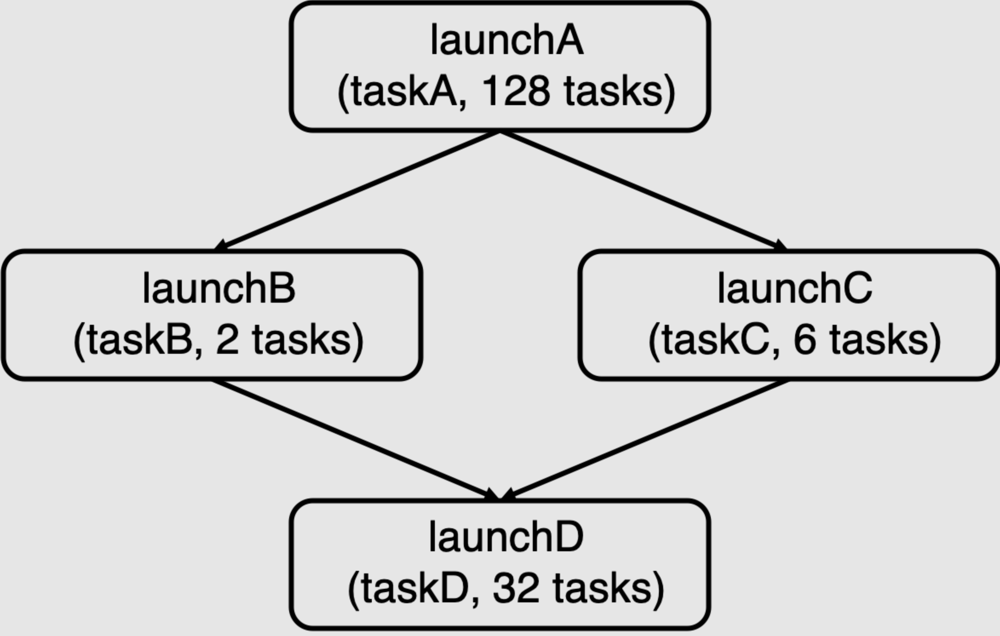

## 概述 ##

每个人都喜欢快速完成任务，而在这个作业中，我们要求你做到这一点！你需要实现一个 C++ 库，能够在多核 CPU 上尽可能高效地执行应用程序提供的任务。

在作业的第一部分，你将实现一个支持 **批量（数据并行）** 启动许多相同任务实例的任务执行库。这种功能类似于你在作业 1 中使用 [ISPC 的任务启动行为](http://ispc.github.io/ispc.html#task-parallelism-launch-and-sync-statements)，实现跨核并行化代码的方式。

在作业的第二部分，你将扩展你的任务运行时系统，使其能够执行更复杂的 **任务图**，其中任务的执行可能依赖于其他任务的结果。这些依赖关系会限制哪些任务可以安全地并行运行，因此你的任务调度系统需要考虑这些约束。在并行机器上对数据并行任务图进行调度执行是许多流行的并行运行时系统的一项重要功能，例如广泛使用的 [Thread Building Blocks](https://github.com/intel/tbb) 库、[Apache Spark](https://spark.apache.org/)，以及现代深度学习框架如 [PyTorch](https://pytorch.org/) 和 [TensorFlow](https://www.tensorflow.org/)。

完成该作业需要你：

- 使用线程池管理任务执行
- 利用同步原语（如互斥锁和条件变量）协调工作线程的执行
- 实现一个能反映任务图中依赖关系的任务调度器
- 理解工作负载特性并做出高效的任务调度决策s

### 等等，我好像之前做过类似的任务？ ###

你可能已经在 CS107 或 CS111 等课程中创建过线程池和任务执行库。  
然而，这次作业是一个更深入理解这些系统的独特机会。  

你将实现多个任务执行库，其中一些不使用线程池，而另一些使用不同类型的线程池。  
通过实现多种任务调度策略并比较它们在不同工作负载上的性能表现，你将更好地理解在构建并行系统时关键设计选择所带来的影响。

## Part A: 同步批量任务启动

在作业 1 中，你使用 ISPC 的任务启动原语通过以下方式启动了 N 个 ISPC 任务实例：`launch[N] myISPCFunction()`。在本作业的第一部分中，你将实现类似功能的任务执行库。

首先，请熟悉 `itasksys.h` 中 `ITaskSystem` 的定义。这个 [抽象类](https://www.tutorialspoint.com/cplusplus/cpp_interfaces.htm) 定义了任务执行系统的接口。接口包含一个名为 `run()` 的方法，其签名如下：

```cpp
virtual void run(IRunnable* runnable, int num_total_tasks) = 0;
```

`run()` 方法执行 `num_total_tasks` 个指定任务的实例。由于单次调用 `run()` 会触发多个任务的执行，我们将每次调用 `run()` 称为一次 **批量任务启动**。

`tasksys.cpp` 提供的起始代码中包含了 `TaskSystemSerial::run()` 的正确但串行的实现，这一实现展示了任务系统如何使用 `IRunnable` 接口来执行批量任务启动。（`IRunnable` 的定义位于 `itasksys.h` 中）。注意，在每次调用 `IRunnable::runTask()` 时，任务系统都会向任务提供当前任务标识符（0 到 `num_total_tasks` 之间的整数），以及批量任务启动中的任务总数。任务的具体实现将根据这些参数决定需要执行的工作。

`run()` 的一个重要细节是，它必须与调用线程同步执行任务。换句话说，当 `run()` 方法返回时，程序可以保证任务系统已经完成了批量任务启动中的 **所有任务**。起始代码中提供的串行实现会在调用线程上执行所有任务，因此满足了此要求。

### 运行测试 ###

起始代码中包含一组使用任务系统的测试应用程序。有关测试工具的详细描述，请参阅 `tests/README.md`；有关测试定义，请参阅 `tests/tests.h`。要运行某个测试，请使用 `runtasks` 脚本。例如，要运行名为 `mandelbrot_chunked` 的测试（该测试通过批量启动任务来计算 Mandelbrot 分形图像，每个任务处理图像的一个连续块），请输入：

```bash
./runtasks -n 16 mandelbrot_chunked
```

不同的测试具有不同的性能特性 —— 有些每个任务的工作量很少，而其他则需要大量处理。有些测试每次启动会创建大量任务，而有些则只创建很少的任务。有时单次启动中的任务计算成本相似，而有时成本则变化较大。大多数测试在 `tests/README.md` 中都有描述，但我们鼓励你查看 `tests/tests.h` 中的代码，以更详细地了解所有测试的行为。

一个可能对调试正确性有帮助的测试是 `simple_test_sync`，这是一个非常小的测试，不适合用于性能测量，但可以通过打印语句或调试器轻松调试。有关此测试的代码，请参阅 `tests/tests.h` 中的 `simpleTest` 函数。

我们鼓励你创建自己的测试。可以参考 `tests/tests.h` 中的现有测试来获取灵感。此外，我们还提供了一个骨架测试，其中包含 `class YourTask` 和函数 `yourTest()`，供你选择使用。如果你创建了新的测试，请确保将其添加到 `tests/main.cpp` 的测试列表和测试名称中，并相应调整变量 `n_tests` 的值。需要注意的是，你可以在自己的解决方案中运行自定义测试，但无法通过参考解决方案编译运行这些测试。

`-n` 命令行选项指定任务系统实现可以使用的最大线程数。例如，上述命令中使用了 `-n 16`，因为 AWS 实例中的 CPU 具有 16 个执行上下文。运行可用测试的完整列表可通过命令行帮助选项（`-h`）获取。

`-i` 命令行选项指定性能测量期间运行测试的次数。为了获得准确的性能测量结果，`./runtasks` 会多次运行测试，并记录几次运行中 _最小_ 的运行时间；通常默认值已足够——更大的值可能会提高精度，但会增加测试运行时间。

此外，我们还提供了用于评分性能的测试工具：

```bash
>>> python3 ../tests/run_test_harness.py
```

测试工具支持以下命令行参数：

```bash
>>> python3 run_test_harness.py -h
usage: run_test_harness.py [-h] [-n NUM_THREADS]
                           [-t TEST_NAMES [TEST_NAMES ...]] [-a]

Run task system performance tests

optional arguments:
  -h, --help            show this help message and exit
  -n NUM_THREADS, --num_threads NUM_THREADS
                        Max number of threads that the task system can use. (16
                        by default)
  -t TEST_NAMES [TEST_NAMES ...], --test_names TEST_NAMES [TEST_NAMES ...]
                        List of tests to run
  -a, --run_async       Run async tests
```

它会生成如下所示的详细性能报告：

```bash
>>> python3 ../tests/run_test_harness.py -t super_light super_super_light
python3 ../tests/run_test_harness.py -t super_light super_super_light
================================================================================
Running task system grading harness... (2 total tests)
  - Detected CPU with 16 execution contexts
  - Task system configured to use at most 16 threads
================================================================================
================================================================================
Executing test: super_super_light...
Reference binary: ./runtasks_ref_linux
Results for: super_super_light
                                        STUDENT   REFERENCE   PERF?
[Serial]                                9.053     9.022       1.00  (OK)
[Parallel + Always Spawn]               8.982     33.953      0.26  (OK)
[Parallel + Thread Pool + Spin]         8.942     12.095      0.74  (OK)
[Parallel + Thread Pool + Sleep]        8.97      8.849       1.01  (OK)
================================================================================
Executing test: super_light...
Reference binary: ./runtasks_ref_linux
Results for: super_light
                                        STUDENT   REFERENCE   PERF?
[Serial]                                68.525    68.03       1.01  (OK)
[Parallel + Always Spawn]               68.178    40.677      1.68  (NOT OK)
[Parallel + Thread Pool + Spin]         67.676    25.244      2.68  (NOT OK)
[Parallel + Thread Pool + Sleep]        68.464    20.588      3.33  (NOT OK)
================================================================================
Overall performance results
[Serial]                                : All passed Perf
[Parallel + Always Spawn]               : Perf did not pass all tests
[Parallel + Thread Pool + Spin]         : Perf did not pass all tests
[Parallel + Thread Pool + Sleep]        : Perf did not pass all tests
```

上述输出中，`PERF` 表示你的实现运行时间与参考实现运行时间的比值。小于 1 的值表明你的任务系统实现比参考实现更快。

> [!提示]
> **Mac 用户：** 虽然我们为 part A 和 part B 提供了参考解决方案的二进制文件，但我们会使用 Linux 二进制文件来测试你的代码。因此，我们建议在提交前使用 AWS 实例检查你的实现。如果你使用的是 M1 芯片的新款 Mac，本地测试时应使用 `runtasks_ref_osx_arm` 二进制文件。否则，请使用 `runtasks_ref_osx_x86`。

> [!重要]
> 我们会使用 AWS ARM 实例上的 `runtasks_ref_linux_arm` 版本的参考解决方案评分。请确保你的代码可以在 AWS ARM 实例上正确运行。

### 你需要完成的任务 ###

你的任务是实现一个任务执行引擎，高效利用多核 CPU。你的实现将根据其**正确性**（必须正确运行所有任务）和**性能**（效率）进行评分。这是一项有趣的编程挑战，但也非易事。为了帮助你保持正确方向，完成作业第 A 部分时，你将逐步实现多个版本的任务系统，逐步提高实现的复杂性和性能。这三个版本的实现将在 `tasksys.cpp/.h` 中定义的类中完成：

* `TaskSystemParallelSpawn`
* `TaskSystemParallelThreadPoolSpinning`
* `TaskSystemParallelThreadPoolSleeping`

**请在 `part_a/` 子目录中实现你的第 A 部分代码，以便与正确的参考实现（`part_a/runtasks_ref_*`）进行比较。**

_提示：注意以下指引采用了“先尝试最简单的改进”的方法。每一步都增加了任务执行系统实现的复杂性，但在每一步中，你应该始终确保有一个正确（完全正确）的任务运行时系统。_

我们还希望你至少创建一个测试，可以用于测试**正确性**或**性能**。有关更多信息，请参阅上文的“运行测试”部分。

#### 第 1 步：迁移到并行任务系统 ####

__在此步骤中，请实现类 `TaskSystemParallelSpawn`。__

起始代码中提供了一个串行任务系统的实现，即 `TaskSystemSerial`。在此作业的这一部分，你需要扩展起始代码，以并行方式执行批量任务。

* 你需要创建额外的控制线程来执行批量任务。注意，`TaskSystem` 构造函数中有一个参数 `num_threads`，它表示你实现中可用于运行任务的**最大工作线程数**。

* 按照“从最简单的事情开始”的思路，我们建议你在 `run()` 函数的开头创建工作线程，并在主线程中等待这些线程完成（通过线程 join）后，`run()` 再返回。虽然这种实现是正确的，但由于频繁的线程创建，会引入显著的开销。

* 你将如何将任务分配给工作线程？应该考虑使用静态还是动态的任务分配方式？

* 是否存在需要保护的共享变量（即任务执行系统的内部状态），防止多个线程同时访问？你可能需要回顾我们的 [C++ 同步教程](tutorial/README.md)，了解 C++ 标准库中的同步原语。

#### 第 2 步：通过线程池减少频繁的线程创建 ####

__在此步骤中，请实现类 `TaskSystemParallelThreadPoolSpinning`。__

第 1 步的实现由于在每次调用 `run()` 时创建线程而引入了额外开销。这种开销在任务计算成本较低时尤为显著。在此步骤中，我们建议你迁移到“线程池”实现，任务执行系统在初始化时（例如在 `TaskSystem` 构造函数中，或第一次调用 `run()` 时）就创建所有工作线程。

* 作为起始实现，我们建议设计让工作线程持续循环检查是否有更多工作要做。（线程进入一个 while 循环直到条件为真，这通常被称为“自旋”）。工作线程如何判断是否有工作需要完成？

* 现在需要非平凡的方式确保 `run()` 实现了所需的同步行为。你需要如何更改 `run()` 的实现来判断批量任务中的所有任务是否已完成？

#### 第 3 步：在空闲时让线程进入休眠 ####

__在此步骤中，请实现类 `TaskSystemParallelThreadPoolSleeping`。__

第 2 步实现的一个缺点是线程在等待有任务要执行时会“自旋”，从而占用 CPU 核心的执行资源。例如，工作线程可能会在循环中等待新任务到来。另一个例子是，主线程可能会在循环中等待工作线程完成所有任务，以便它可以从 `run()` 调用返回。这种行为会影响性能，因为即使线程没有做有意义的工作，它们也会占用 CPU 资源。

在此部分作业中，你需要通过让线程进入休眠（直到满足其等待的条件）来提高任务系统的效率。

* 你的实现可以选择使用条件变量来实现此行为。条件变量是一种同步原语，它允许线程在等待条件成立时进入休眠（不占用 CPU 资源）。其他线程可以“通知”这些等待线程，条件已经满足，可以唤醒它们。例如，当没有任务要完成时，工作线程可以进入休眠（这样就不会抢占执行有意义工作的线程的 CPU 资源）。另一个例子是，当主线程调用 `run()` 时，可以在等待批量任务完成时进入休眠（否则自旋中的主线程会抢占工作线程的 CPU 资源！）。更多信息请参阅我们的 [C++ 同步教程](tutorial/README.md)。

* 此部分实现中可能会出现复杂的竞争条件。你需要考虑线程行为的多种可能交错顺序。

* 你可能需要编写额外的测试用例来验证系统行为。__作业起始代码包含了评分脚本会用来评估你代码性能的工作负载，但我们也会使用更广泛的工作负载集来测试你的实现的正确性，这些工作负载没有包含在起始代码中！__

### Part B: 支持任务图的执行

在本部分作业中，你将扩展 Part A 中的任务系统实现，以支持异步启动具有依赖关系的任务。任务之间的这些依赖关系会形成调度约束，你的任务执行库必须遵循这些约束。

`ITaskSystem` 接口有一个额外的方法：

```cpp
virtual TaskID runAsyncWithDeps(IRunnable* runnable, int num_total_tasks,
                                const std::vector<TaskID>& deps) = 0;
```

`runAsyncWithDeps()` 方法与 `run()` 方法类似，用于执行一批任务。但它有一些不同之处：

#### 异步任务启动 ####

首先，通过 `runAsyncWithDeps()` 创建的任务将在调用线程之外 _异步_ 执行。这意味着 `runAsyncWithDeps()` 应该立即返回，即使任务尚未完成执行。该方法会返回一个与此次批量任务启动相关的唯一标识符。

调用线程可以通过调用 `sync()` 来确定批量任务启动是否完成。

```cpp
virtual void sync() = 0;
```

`sync()` 只有在所有先前批量任务启动的任务完成时，才会返回调用者。例如，考虑以下代码：

```cpp
// 假设 taskA 和 taskB 是有效的 IRunnable 实例...

std::vector<TaskID> noDeps;  // 空向量

ITaskSystem *t = new TaskSystem(num_threads);

// 批量启动 4 个任务
TaskID launchA = t->runAsyncWithDeps(taskA, 4, noDeps);

// 批量启动 8 个任务
TaskID launchB = t->runAsyncWithDeps(taskB, 8, noDeps);

// 此时，任务 launchA 和 launchB 可能仍在执行

t->sync();

// 此时，launchA 和 launchB 相关的所有 12 个任务都已完成
```

如上所述，调用线程在调用 `sync()` 之前无法保证 `runAsyncWithDeps()` 中的先前任务已完成。准确地说，`runAsyncWithDeps()` 告诉任务系统执行新的批量任务启动，但你的实现可以在下一次调用 `sync()` 之前的任何时间执行这些任务。需要注意的是，这种规格意味着，你的实现不必在启动 `launchB` 的任务之前执行 `launchA` 的任务！

#### 显式依赖支持 ####

`runAsyncWithDeps()` 的第二个关键细节是它的第三个参数：一个 TaskID 标识符的向量，该向量必须引用通过 `runAsyncWithDeps()` 启动的先前批量任务。这个向量指定当前批量任务启动所依赖的先前任务。__因此，当前批量任务启动的任何任务，在其依赖的任务完成之前，都不能开始执行！__ 例如，考虑以下示例：

```cpp
std::vector<TaskID> noDeps;  // 空向量
std::vector<TaskID> depOnA;
std::vector<TaskID> depOnBC;

ITaskSystem *t = new TaskSystem(num_threads);

TaskID launchA = t->runAsyncWithDeps(taskA, 128, noDeps);
depOnA.push_back(launchA);

TaskID launchB = t->runAsyncWithDeps(taskB, 2, depOnA);
TaskID launchC = t->runAsyncWithDeps(taskC, 6, depOnA);
depOnBC.push_back(launchB);
depOnBC.push_back(launchC);

TaskID launchD = t->runAsyncWithDeps(taskD, 32, depOnBC);
t->sync();
```

上述代码包含了四个批量任务启动（taskA: 128 个任务，taskB: 2 个任务，taskC: 6 个任务，taskD: 32 个任务）。注意，`launchB` 和 `launchC` 的启动依赖于 `launchA`，而 `launchD` 的启动依赖于 `launchB` 和 `launchC`。因此，虽然任务系统可以并行执行 `launchB` 和 `launchC` 中的任务（包括并行执行），但 `launchB` 和 `launchC` 的所有任务必须在执行任何 `launchD` 的任务之前完成。

我们可以通过一个 __任务图__ 来可视化这些依赖关系。任务图是一个有向无环图（DAG），图中的节点对应批量任务启动，节点 X 到节点 Y 的边表示 Y 依赖于 X 的输出。上述代码的任务图如下所示：

<p align="center">
    
</p>

请注意，如果你在拥有 8 个执行上下文的机器上运行上述代码，能够将 `launchB` 和 `launchC` 中的任务并行调度可能会非常有用，因为单独的 `launchB` 或 `launchC` 任务启动并不足以充分利用机器的所有执行资源。

### 测试 ###
所有带有 `Async` 后缀的测试用例应当用于测试 Part B。评分工具中包含的测试集可在 `tests/README.md` 中找到，所有测试用例都可以在 `tests/tests.h` 中找到，并列出了 `tests/main.cpp` 中的所有测试用例。为了调试正确性，我们提供了一个小的测试 `simple_test_async`。请查看 `tests/tests.h` 中的 `simpleTest` 函数。`simple_test_async` 应该足够小，可以通过在 `simpleTest` 中使用打印语句或断点来调试。

我们鼓励你创建自己的测试。请参考 `tests/tests.h` 中现有的测试，获取灵感。如果你创建了自己的测试，记得将它们添加到 `tests/main.cpp` 中的测试列表中，并相应地调整 `n_tests`。请注意，虽然你可以在自己的解决方案中运行这些测试，但我们无法编译参考解决方案来运行你的测试。

### 你需要做的 ###

你需要扩展 Part A 中使用线程池（并使用睡眠）的任务系统实现，以正确实现 `TaskSystemParallelThreadPoolSleeping::runAsyncWithDeps()` 和 `TaskSystemParallelThreadPoolSleeping::sync()`。我们还期望你创建至少一个测试，用于测试正确性或性能。有关更多信息，请参见上面的 `Testing` 部分。作为澄清，你只需要实现 `TaskSystemParallelThreadPoolSleeping::runAsyncWithDeps()` 和 `sync()`，而无需实现其他 `TaskSystem` 类。

像 Part A 一样，我们给出了一些开始的提示：

* 可以考虑将 `runAsyncWithDeps()` 的行为视为将与批量任务启动相关的记录推送到一个“工作队列”中。一旦相关记录被推送到队列中，`runAsyncWithDeps()` 就可以返回给调用者。

* 本部分作业的关键是进行适当的书面记录来跟踪依赖关系。当批量任务启动中的所有任务完成时，应该做什么？（此时可以启动新任务。）

* 在实现中使用两个数据结构可能会很有帮助：（1）表示通过 `runAsyncWithDeps()` 向系统添加的任务，这些任务尚未准备好执行，因为它们依赖于其他任务完成（这些任务是“等待”的任务）；（2）一个“就绪队列”，它包含不依赖任何先前任务的任务，可以在有可用工作线程时立即执行。

* 在生成唯一的任务启动 ID 时，你不需要担心整数溢出。我们不会向你的任务系统发送超过 2^31 次的批量任务启动。

* 可以假设所有程序将仅调用 `run()` 或 `runAsyncWithDeps()`，即你无需处理 `run()` 调用需要等待所有后续 `runAsyncWithDeps()` 调用完成的情况。需要注意的是，这一假设意味着，你可以使用适当的 `runAsyncWithDeps()` 和 `sync()` 调用来实现 `run()`。

* 你可以假设，唯一的多线程操作是通过你的实现创建的多个线程。也就是说，我们不会额外生成线程并从这些线程调用你的实现。

__在 `part_b/` 子目录中实现你的 Part B 部分，与你的正确参考实现（`part_b/runtasks_ref_*`）进行比较。__

## 评分 ##

作业的分数分配如下：

**Part A (50 分)**  
- 5 分：`TaskSystemParallelSpawn::run()` 的正确性 + 性能。（共 10 分）  
- 10 分：`TaskSystemParallelThreadPoolSpinning::run()` 和 `TaskSystemParallelThreadPoolSleeping::run()` 的正确性 + 性能。（共 40 分）

**Part B (40 分)**  
- 30 分：`TaskSystemParallelThreadPoolSleeping::runAsyncWithDeps()`、`TaskSystemParallelThreadPoolSleeping::run()` 和 `TaskSystemParallelThreadPoolSleeping::sync()` 的正确性  
- 10 分：`TaskSystemParallelThreadPoolSleeping::runAsyncWithDeps()`、`TaskSystemParallelThreadPoolSleeping::run()` 和 `TaskSystemParallelThreadPoolSleeping::sync()` 的性能

**报告（10 分）**  
- 请参阅“Handin”部分了解更多详细信息。

对于每个测试，只有在实现的性能与参考实现相差不超过 20% 时，才能才能获得分数。